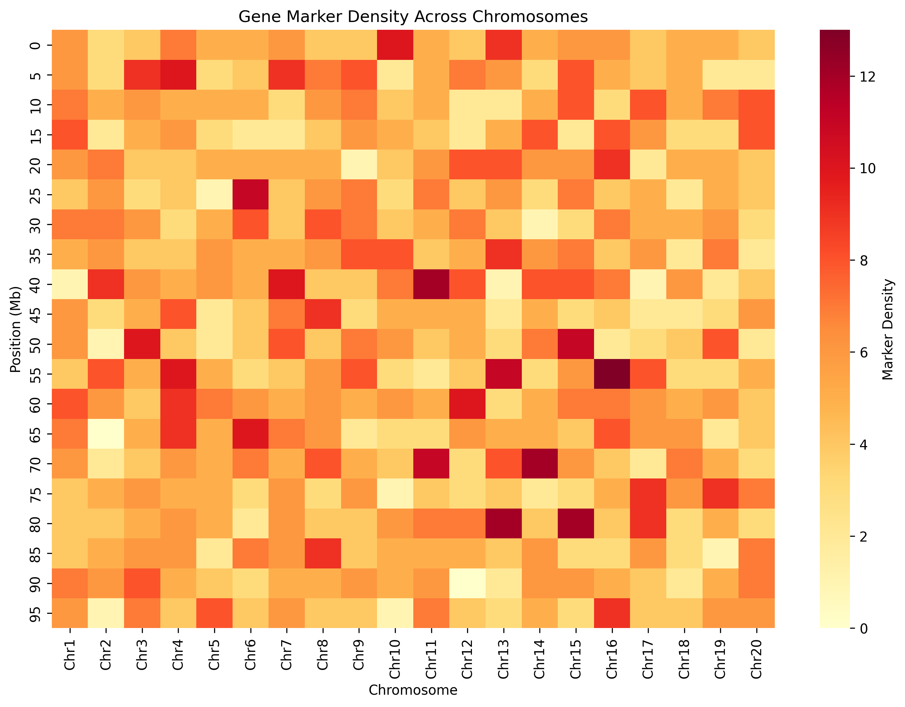
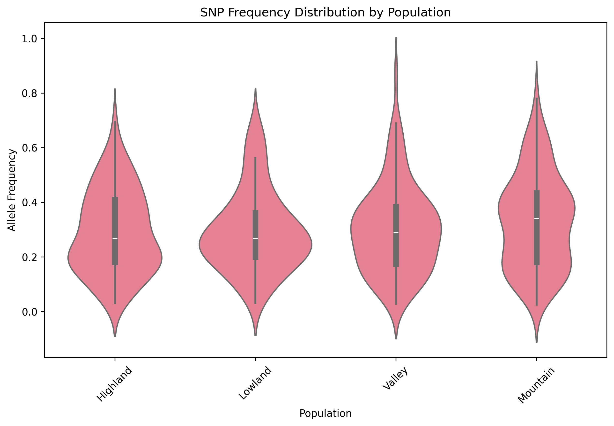
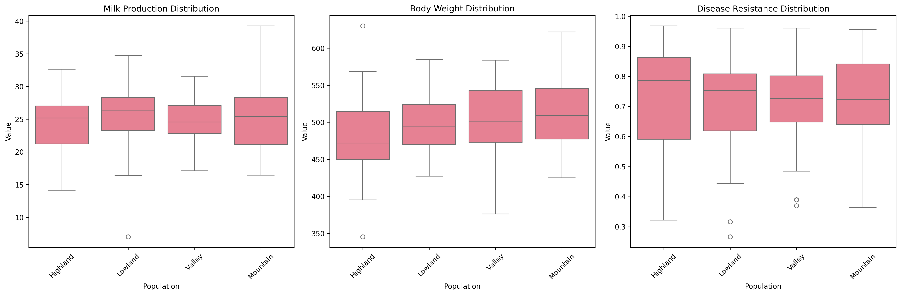
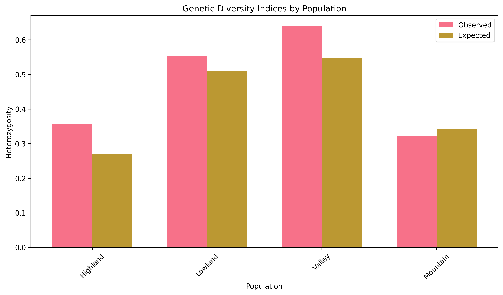

# Yak Genetic Breeding - Gene Feature Query and Analysis

## Project Overview
End-to-end pipeline for yak breeding research, focused on identifying and analyzing genetic traits linked to desirable breeding characteristics.

## Development Setup

### Prerequisites
- Python 3.12+
- Required packages will be listed in `requirements.txt`

### Installation
```bash
# Create and activate virtual environment
python -m venv venv
source venv/bin/activate

# Install dependencies (once requirements.txt is created)
pip install -r requirements.txt
```

### Code Style & Linting
This project uses flake8 for linting Python code. To run the linter:

```bash
# Install flake8 if not already installed
pip install flake8

# Run linting
flake8 .
```

#### Linting Configuration
The project uses standard flake8 configuration with the following settings in `.flake8`:
- Max line length: 100 characters
- Exclude patterns: `.git`, `__pycache__`, `venv`

## Project Structure
The pipeline consists of the following modules:
1. Data Ingestion and Preprocessing
2. Gene Marker Extraction
3. Feature Analysis Report Generation
4. Genetic Diversity Analysis
5. Visualization Module

For detailed module descriptions and implementation requirements, see the project documentation.

## Visualizations
The following visualizations demonstrate key aspects of the yak genetic analysis pipeline:

### Marker Density Distribution

This heatmap visualizes the distribution of genetic markers across chromosomes, helping identify regions with high marker density that may be significant for trait analysis. Darker colors indicate higher marker density.

### SNP Distribution Across Populations

This violin plot shows the distribution of SNP frequencies across different yak populations (Highland, Lowland, Valley, Mountain). The plot helps identify population-specific genetic variations and potential selective pressures.

### Trait Distribution Analysis

Multi-population trait distribution analysis showing the distribution of key traits (Milk Production, Body Weight, Disease Resistance) across different yak populations. These plots help identify population-specific trait characteristics.

### Genetic Diversity Indices

Comparison of observed and expected heterozygosity across populations, providing insights into genetic diversity and potential inbreeding effects within each population.

## Contributing
1. Create a new branch for your feature
2. Make your changes
3. Run linting checks before committing
4. Create a pull request

## License
[License details to be determined]
